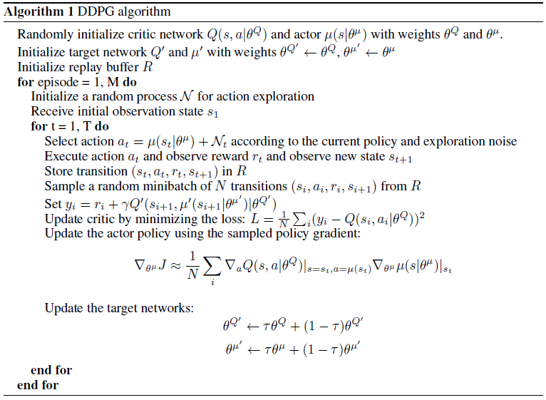
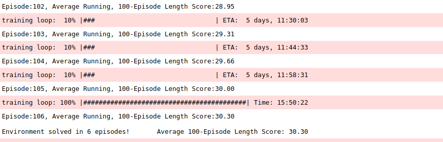
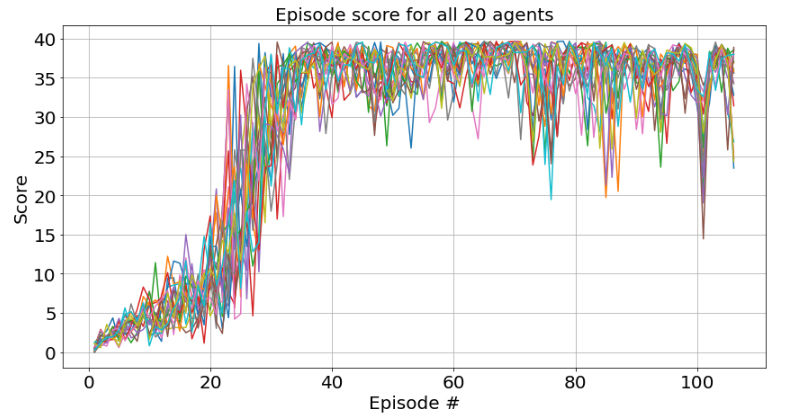

# Reach For The Sky

## Project Objective

In this project, **the objective is to train an agent (double-jointed arm) to move to target locations. The goal of the agent is to maintain its position at the target location for as many time steps as possible.**


## Environment details

In this environment, a double-jointed arm can move to target locations. A reward of +0.1 is provided for each step that the agent's hand is in the goal location. Thus, the goal of your agent is to maintain its position at the target location for as many time steps as possible.

The observation space consists of 33 variables corresponding to position, rotation, velocity, and angular velocities of the arm. Each action is a vector with four numbers, corresponding to torque applicable to two joints. Every entry in the action vector should be a number between -1 and 1.

- Set-up: Double-jointed arm which can move to target locations.
- Goal: The agents must move its hand to the goal location, and keep it there.
- Agents: The environment contains 20 agent with same Behavior Parameters.
- Agent Reward Function (independent):
  - +0.1 Each step agent's hand is in goal location.
- Behavior Parameters:
  - Vector Observation space: 26 variables corresponding to position, rotation,
    velocity, and angular velocities of the two arm rigid bodies.
  - Vector Action space: (Continuous) Size of 4, corresponding to torque
    applicable to two joints.
  - Visual Observations: None.
- Float Properties: Five
  - goal_size: radius of the goal zone
    - Default: 5
    - Recommended Minimum: 1
    - Recommended Maximum: 10
  - goal_speed: speed of the goal zone around the arm (in radians)
    - Default: 1
    - Recommended Minimum: 0.2
    - Recommended Maximum: 4
  - gravity
    - Default: 9.81
    - Recommended Minimum: 4
    - Recommended Maximum: 20
  - deviation: Magnitude of sinusoidal (cosine) deviation of the goal along the
    vertical dimension
    - Default: 0
    - Recommended Minimum: 0
    - Recommended Maximum: 5
  - deviation_freq: Frequency of the cosine deviation of the goal along the
    vertical dimension
    - Default: 0
    - Recommended Minimum: 0
    - Recommended Maximum: 3
- Benchmark Mean Reward: 30

The task is episodic, and **in order to solve the environment, the average score of the 20 agents must achieve an average score of +30 over 100 consecutive episodes.**

## Agent Implementation

### DDPG 

This project implements a *Policy Based* method called Deep Determininistic Policy Gradient [DDPG](https://arxiv.org/abs/1509.02971). 
> ABSTRACT: We adapt the ideas underlying the success of Deep Q-Learning to the continuous action domain. We present an actor-critic, model-free algorithm based on the deterministic policy gradient that can operate over continuous action spaces. Using the same learning algorithm, network architecture and hyper-parameters, our algorithm robustly solves more than 20 simulated physics tasks, including classic problems such as cartpole swing-up, dexterous manipulation, legged locomotion and car driving. Our algorithm is able to find policies whose performance is competitive with those found by a planning algorithm with full access to the dynamics of the domain and its derivatives. We further demonstrate that for many of the tasks the algorithm can learn policies end-to-end: directly from raw pixel inputs.

Deep Determininistic Policy Gradient leverages a number techniques:
- A Reinforcement Learning method for continuous-action spaces
- Q-table approximation (action-values) using a Deep Neural Network (the Actor)
- An action estimation (action to take) using a Deep Neural Network (the Critic

This implementation includes other training improvements: 
- Experience Replay
- Fixed Q Targets
- Soft Updates
- Ornstein-Unlenbeck Process

### Algorithm



This algorithm is taken from the [ontinuous control with deep reinforcement learning](https://arxiv.org/abs/1509.02971).


### Code implementation

The code is based on the "DDPG Actor-Critic Methods" repository from the [Deep Reinforcement Learning Nanodegree](https://github.com/udacity/deep-reinforcement-learning/tree/master/ddpg-pendulum), and has been modified to solve the continuous control problem in the Reacher environment.

Relevant files include:
- Continuous_Control.ipynb : This Jupyter notebook file is the main driver to allow agent training. It does the following:
  - Imports necessary packages 
  - Examines the state and action spaces
  - Takes Random Actions in the Environment
  - Trains an agent using DDPG
  - Saves the actor model and critic model when target score is achieved
  - Plot the scores
  - Saves the scores
  
- model.py : This file defines two PyTorch classes, the Actor network and the Critic network. 

	- The Actor network is a fully connected Deep Neural Network using the [PyTorch Framework](https://pytorch.org/docs/0.4.0/). This network is trained to predict the action to perform depending on the environment observed states. This Neural Network is used by the DDPG agent and is composed of:
	  - the input layer, its size is equal to the state_size parameter passed into the constructor
	  - Two hidden fully connected layers, one with 256 cells and the second with 128 cells
	  - The output layer which size is set to the action_size parameter passed in the constructor
	  - The final activation is tanh
	  
	- The Critic network is also fully connected Deep Neural Network using the [PyTorch Framework](https://pytorch.org/docs/0.4.0/). This network is trained to predict the Q-values depending on the environment observed states and the action prediction from the Actor network. This Neural Network is used by the DDPG agent and is composed of:
	  - the input layer, its size is equal to the state_size parameter passed into the constructor
	  - Two hidden fully connected layers, one with 128 cells and the second with 64 cells
	  - The output from the first fully connected layer is passed through a ReLU activation and concatenated with the action from the Actor network such that the number of inputs to the second hidden layer is the size of the output from the first hidden layer plus the size of the action from the Actor network.
	  - The output layer which size is 1, which is the estimated Q-value.
  
- ddpg_agent.py : This file defines a DDPG agent, and an Ornstein-Uhlenbeck process and a Replay Buffer memory, both used by the DDPG agent. 
  - The DDPG agent class is implemented, as described in the Deep Deterministic Policy Gradient algorithm. It provides several methods:
    - constructor: 
      - Initialize the memory buffer (*Replay Buffer*)
      - Initialize two instances of both the Actor neural network and Critic neural network defined in model.py : the *target* network and the *local* network
	  - Initialize the Ornstein-Uhlenbeck noise process
    - step function: 
      - Allows to store a step taken by the agent (state, action, reward, next_state, done) in the Replay Buffer/Memory
	  - Every 20 steps, updates the Actor's and Critic's *target* network weights with the current weight values from the respective *local* network, 10 times.
    - act function: returns the actions for the given state given under by the current policy. Action selection is done by using the output of the Actor *local* Network, given the current observed state with a decayed noise sample from the Ornstein-Uhlenbeck process.
    - learn function: First, the Critic's *local* network parameters are updated using a given batch of experiences from the replay buffer. This is accomplished by computing Q-values from the Critic's *target* network and the Q-values from the Critic's *local* network. The mean square error between between these Q-values are the critic loss. Next, the Actor *local* network parameters are updated using the negative of the mean of the output of the Critic *local* network, given observed states and the actions predicted by the Actor *local* network. 
    - soft_update function is called by learn() to update the *target* neural network parameters with a weighted combination of the *local* network weights and *target* network weights.
  - The ReplayBuffer class implements a fixed-size buffer to store experience tuples  (state, action, reward, next_state, done) 
    - add function adds an experience step to the memory
    - sample function randomly samples a batch of experience steps for the learning       


### DDPG Parameters Values, Model Architectures and Results

The DDPG agent uses the following parameters values (defined in ddpg_agent.py):

```
BUFFER_SIZE = int(1e6)  # Replay buffer size
BATCH_SIZE = 1024       # Minibatch size 
GAMMA = 0.85            # Discount factor 
TAU = 1e-3              # For soft update of target parameters
LR_ACTOR = 1e-4         # Learning rate for actor network
LR_CRITIC = 1e-3		# Learning rate for the critic network
WEIGHT_DECAY = 0		# L2 Regularization
UPDATE EVERY = 20		# How often to update the network
UPDATE_TIMES = 10       # How many times to update the network
NOISE_DECAY  = 0.999    # Noise decay factor
```

The Actor Neural Networks use the following architecture:

```
Input nodes (33) -> Fully Connected Layer (256 nodes, Relu activation) -> Fully Connected Layer (128 nodes, Relu activation) -> Ouput nodes (1)
```

The Actor networks use Adam optimization with a learning rate of LR=1e-4 and are trained using a BATCH_SIZE=1024.

The Critic Neural Networks use the following architecture:

```
Input nodes (33) -> Fully Connected Layer (128 nodes, Relu activation) -> Fully Connected Layer (64 nodes, Relu activation) -> Ouput nodes (1)
```

The networks use Adam optimization with a learning rate of LR=1e-3 and are trained using a BATCH_SIZE=1024.

With the given architecture and parameters, the training logs and results are shown below:





**These results meets the project's expectation as the agents are able to receive an average reward (over 100 episodes) of at least +30.0, and in fewer than 150 episodes. The problem was considered solved after Episode 6.**

### Ideas for Future Work

Training the agent with different hyper-parameters, such as the  parameters of each of actor and critic network, including adding dropout layers, changing activation functions, batch size, discount factor and update frequency could lead to improved performance, as well as faster convergence. Furthermore, other techniques could be imeplemented to improve performance:

- [Proximal Policy Optimization - PPO](https://arxiv.org/abs/1707.06347) 
> ABSTRACT: We propose a new family of policy gradient methods for reinforcement learning, which alternate between sampling data through interaction with the environment, and optimizing a “surrogate” objective function using stochastic gradient ascent. Whereas standard policy gradient methods perform one gradient update per data sample, we propose a novel objective function that enables multiple epochs of minibatch updates. The new methods, which we call proximal policy optimization (PPO), have some of the benefits of trust region policy optimization (TRPO), but they are much simpler to implement, more general, and have better sample complexity (empirically). Our experiments test PPO on a collection of benchmark tasks, including simulated robotic locomotion and Atari game playing, and we show that PPO outperforms other online policy gradient methods, and overall strikes a favorable balance between sample complexity, simplicity, and wall-time.

- [Asynchronous Advatage Actor Critic - A3C](https://arxiv.org/abs/1602.01783) 
> ABSTRACT: We propose a conceptually simple and lightweight framework for deep reinforcement learning that uses asynchronous gradient descent for optimization of deep neural network controllers. We present asynchronous variants of four standard reinforcement learning algorithms and show that parallel actor-learners have a stabilizing effect on training allowing all four methods to successfully train neural network controllers. The best performing method, an asynchronous variant of actor-critic, surpasses the current state-of-the-art on the Atari domain while training for half the time on a single multi-core CPU instead of a GPU. Furthermore, we show that asynchronous actor-critic succeeds
on a wide variety of continuous motor control problems as well as on a new task of navigating random 3D mazes using a visual input.

- [Distributed Distributional Deep Deterministic Policy Gradient - D4PG](https://openreview.net/pdf?id=SyZipzbCb) 
> ABSTRACT: This work adopts the very successful distributional perspective on reinforcement learning and adapts it to the continuous control setting. We combine this within a distributed framework for off-policy learning in order to develop what we call the Distributed Distributional Deep Deterministic Policy Gradient algorithm, D4PG. We also combine this technique with a number of additional, simple improvements such as the use of N-step returns and prioritized experience replay. Experimentally we examine the contribution of each of these individual components and show how they interact, as well as their combined contributions. Our results show that across a wide variety of simple control tasks, difficult manipulation tasks, and a set of hard obstacle-based locomotion tasks the D4PG algorithm achieves state of the art performance.

### Training Hardware Configuration 

The agents were trained on an Nvidia Titan X 12GB GPU. The Unity environment without visualization was used during training.